# GameConnecting 项目运行流程

## 概述

本文档详细描述GameConnecting项目的完整运行流程，包括用户注册、登录、房间管理、实时通信等核心功能的执行流程。

## 系统启动流程

### 1. 后端服务启动

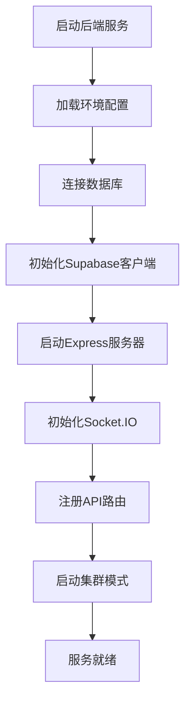
```mermaid
graph TD
    A[启动后端服务] --> B[加载环境配置]
    B --> C[连接数据库]
    C --> D[初始化Supabase客户端]
    D --> E[启动Express服务器]
    E --> F[初始化Socket.IO]
    F --> G[注册API路由]
    G --> H[启动集群模式]
    H --> I[服务就绪]
```

#### 详细步骤
1. **环境配置加载**
   - 读取`.env.development`或`.env.production`
   - 验证必需环境变量
   - 设置默认配置

2. **数据库连接**
   - 连接Supabase PostgreSQL
   - 验证连接状态
   - 检查数据库迁移状态

3. **服务初始化**
   - 创建Express应用
   - 配置中间件（CORS、压缩、认证）
   - 注册API路由
   - 初始化Socket.IO服务器

4. **集群模式**
   - 检查`ENABLE_CLUSTERING`环境变量
   - 创建多个工作进程
   - 监控进程状态

### 2. 前端服务启动

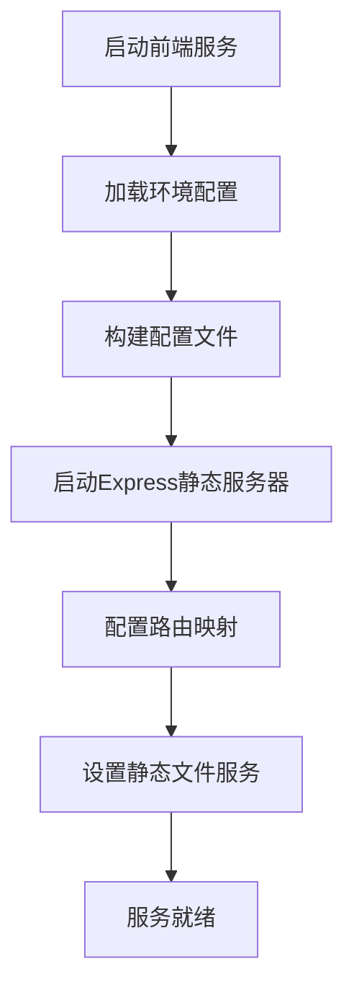
```mermaid
graph TD
    A[启动前端服务] --> B[加载环境配置]
    B --> C[构建配置文件]
    C --> D[启动Express静态服务器]
    D --> E[配置路由映射]
    E --> F[设置静态文件服务]
    F --> G[服务就绪]
```

#### 详细步骤
1. **环境配置**
   - 读取环境变量
   - 生成前端配置文件
   - 设置API端点

2. **服务器配置**
   - 创建Express应用
   - 配置静态文件服务
   - 设置页面路由
   - 配置健康检查端点

## 用户认证流程

### 1. 用户注册流程

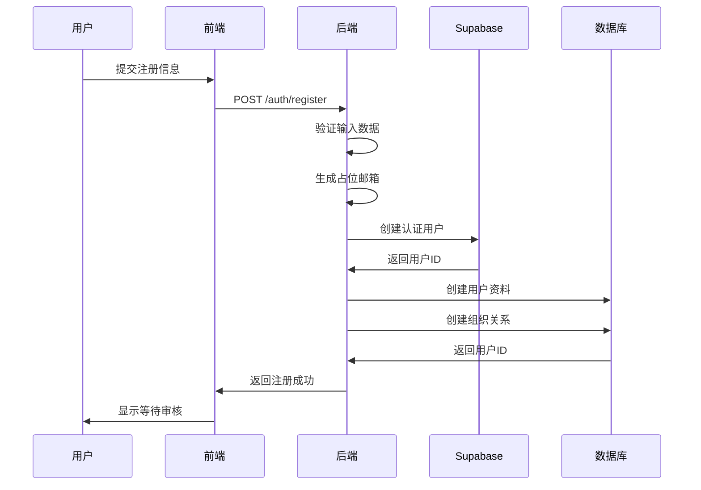
```mermaid
sequenceDiagram
    participant U as 用户
    participant F as 前端
    participant B as 后端
    participant S as Supabase
    participant D as 数据库

    U->>F: 提交注册信息
    F->>B: POST /auth/register
    B->>B: 验证输入数据
    B->>B: 生成占位邮箱
    B->>S: 创建认证用户
    S->>B: 返回用户ID
    B->>D: 创建用户资料
    B->>D: 创建组织关系
    D->>B: 返回用户ID
    B->>F: 返回注册成功
    F->>U: 显示等待审核
```

#### 详细步骤
1. **前端验证**
   - 验证用户名格式
   - 验证密码强度
   - 检查必填字段

2. **后端处理**
   - 规范化用户名
   - 生成唯一占位邮箱
   - 通过Supabase Admin API创建用户
   - 创建用户资料记录
   - 处理组织申请

3. **状态设置**
   - 用户状态设为`pending`
   - 等待管理员审批
   - 发送确认消息

### 2. 用户登录流程

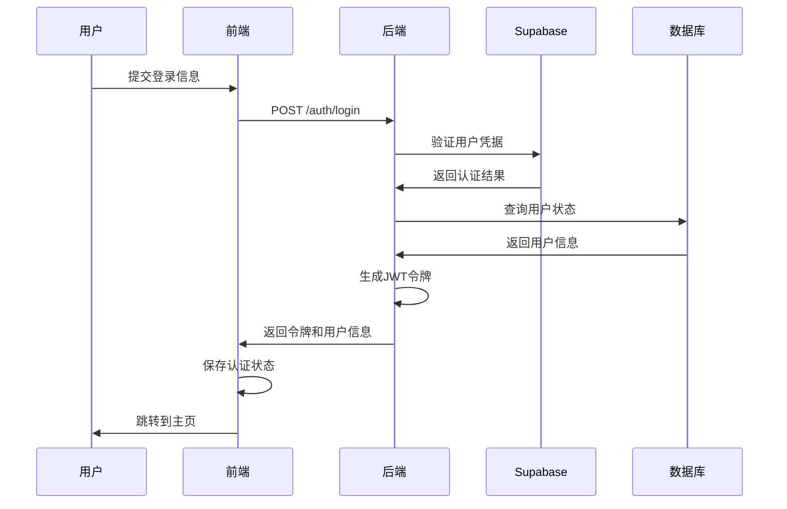
```mermaid
sequenceDiagram
    participant U as 用户
    participant F as 前端
    participant B as 后端
    participant S as Supabase
    participant D as 数据库

    U->>F: 提交登录信息
    F->>B: POST /auth/login
    B->>S: 验证用户凭据
    S->>B: 返回认证结果
    B->>D: 查询用户状态
    D->>B: 返回用户信息
    B->>B: 生成JWT令牌
    B->>F: 返回令牌和用户信息
    F->>F: 保存认证状态
    F->>U: 跳转到主页
```

#### 详细步骤
1. **凭据验证**
   - 验证用户名和密码
   - 检查用户状态
   - 验证账户权限

2. **令牌生成**
   - 生成访问令牌（短期）
   - 生成刷新令牌（长期）
   - 设置过期时间

3. **状态保存**
   - 前端保存令牌
   - 设置自动刷新
   - 更新用户状态

### 3. 令牌刷新流程

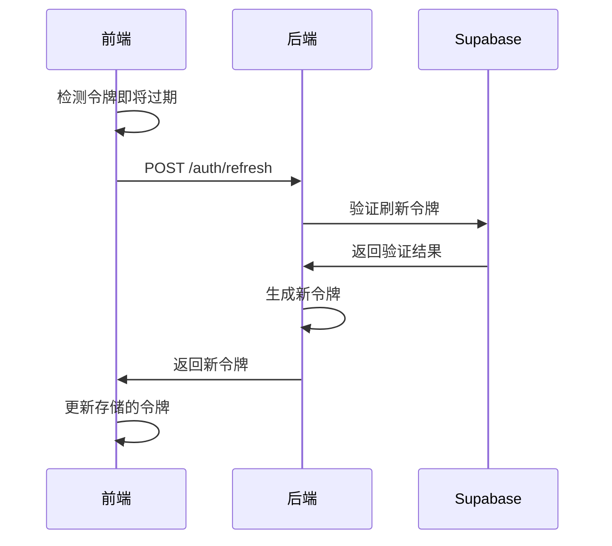
```mermaid
sequenceDiagram
    participant F as 前端
    participant B as 后端
    participant S as Supabase

    F->>F: 检测令牌即将过期
    F->>B: POST /auth/refresh
    B->>S: 验证刷新令牌
    S->>B: 返回验证结果
    B->>B: 生成新令牌
    B->>F: 返回新令牌
    F->>F: 更新存储的令牌
```

## 房间管理流程

### 1. 房间创建流程

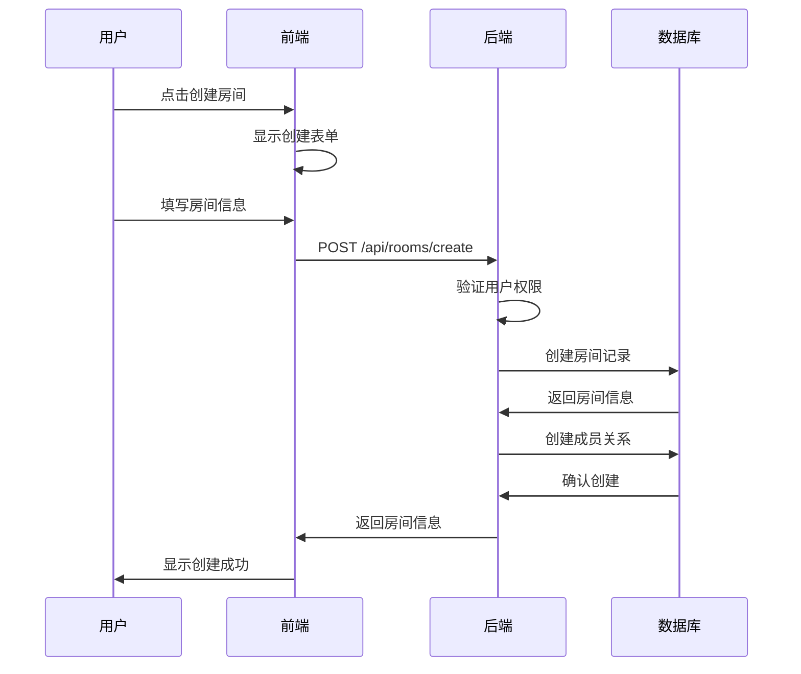
```mermaid
sequenceDiagram
    participant U as 用户
    participant F as 前端
    participant B as 后端
    participant D as 数据库

    U->>F: 点击创建房间
    F->>F: 显示创建表单
    U->>F: 填写房间信息
    F->>B: POST /api/rooms/create
    B->>B: 验证用户权限
    B->>D: 创建房间记录
    D->>B: 返回房间信息
    B->>D: 创建成员关系
    D->>B: 确认创建
    B->>F: 返回房间信息
    F->>U: 显示创建成功
```

#### 详细步骤
1. **权限验证**
   - 检查用户认证状态
   - 验证用户权限
   - 检查创建限制

2. **房间创建**
   - 验证房间名称
   - 检查名称唯一性
   - 创建房间记录

3. **成员关系**
   - 创建者自动成为所有者
   - 设置所有者权限
   - 记录创建时间

### 2. 房间加入流程

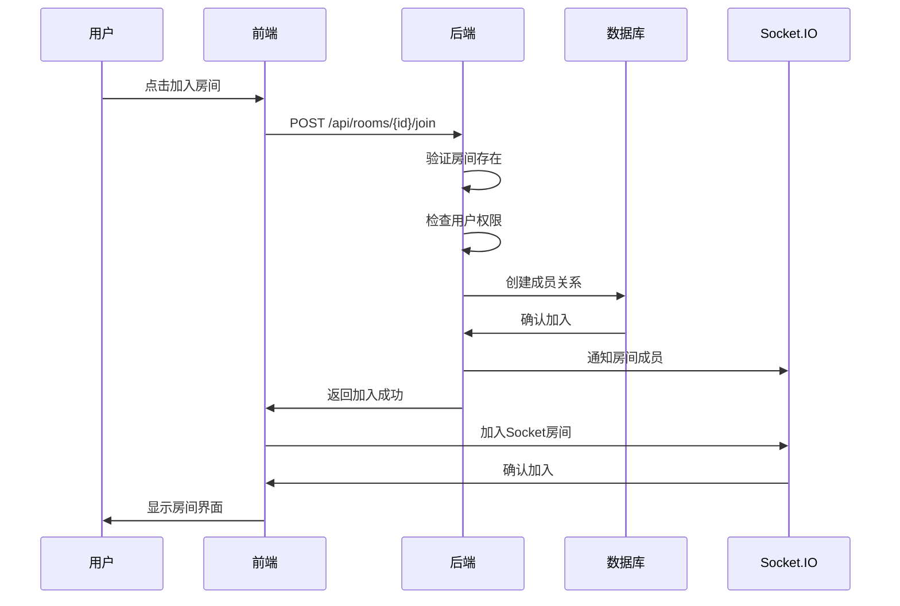
```mermaid
sequenceDiagram
    participant U as 用户
    participant F as 前端
    participant B as 后端
    participant D as 数据库
    participant S as Socket.IO

    U->>F: 点击加入房间
    F->>B: POST /api/rooms/{id}/join
    B->>B: 验证房间存在
    B->>B: 检查用户权限
    B->>D: 创建成员关系
    D->>B: 确认加入
    B->>S: 通知房间成员
    B->>F: 返回加入成功
    F->>S: 加入Socket房间
    S->>F: 确认加入
    F->>U: 显示房间界面
```

### 3. 房间离开流程

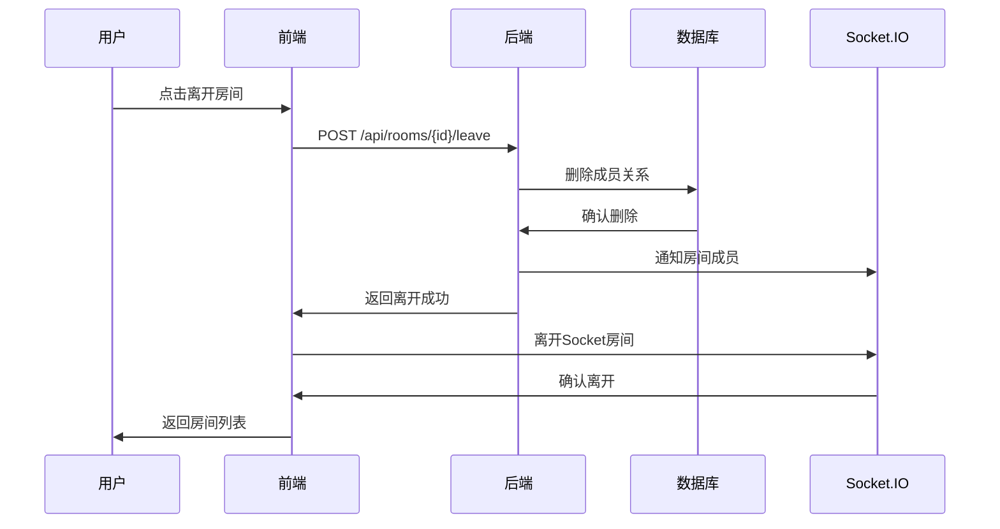
```mermaid
sequenceDiagram
    participant U as 用户
    participant F as 前端
    participant B as 后端
    participant D as 数据库
    participant S as Socket.IO

    U->>F: 点击离开房间
    F->>B: POST /api/rooms/{id}/leave
    B->>D: 删除成员关系
    D->>B: 确认删除
    B->>S: 通知房间成员
    B->>F: 返回离开成功
    F->>S: 离开Socket房间
    S->>F: 确认离开
    F->>U: 返回房间列表
```

## 实时通信流程

### 1. Socket.IO连接流程

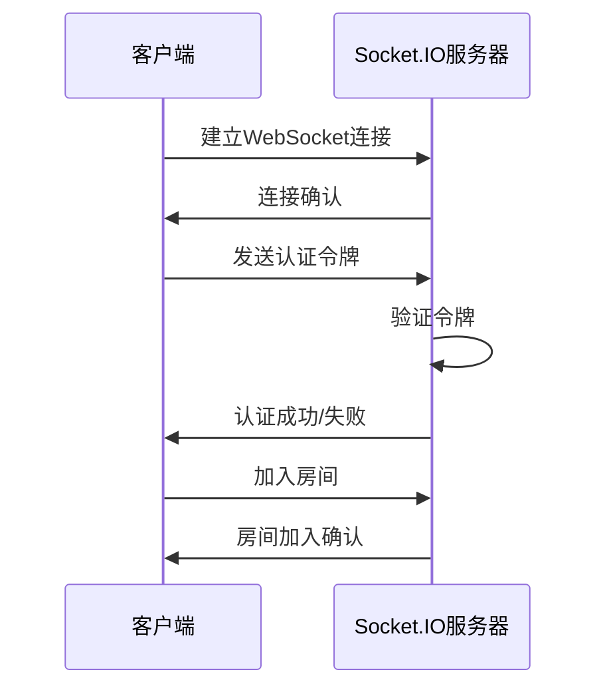
```mermaid
sequenceDiagram
    participant C as 客户端
    participant S as Socket.IO服务器

    C->>S: 建立WebSocket连接
    S->>C: 连接确认
    C->>S: 发送认证令牌
    S->>S: 验证令牌
    S->>C: 认证成功/失败
    C->>S: 加入房间
    S->>C: 房间加入确认
```

#### 详细步骤
1. **连接建立**
   - 客户端发起WebSocket连接
   - 服务器接受连接
   - 建立双向通信

2. **身份认证**
   - 客户端发送JWT令牌
   - 服务器验证令牌
   - 绑定用户身份

3. **房间管理**
   - 客户端加入房间
   - 服务器记录成员
   - 通知其他成员

### 2. 消息传递流程

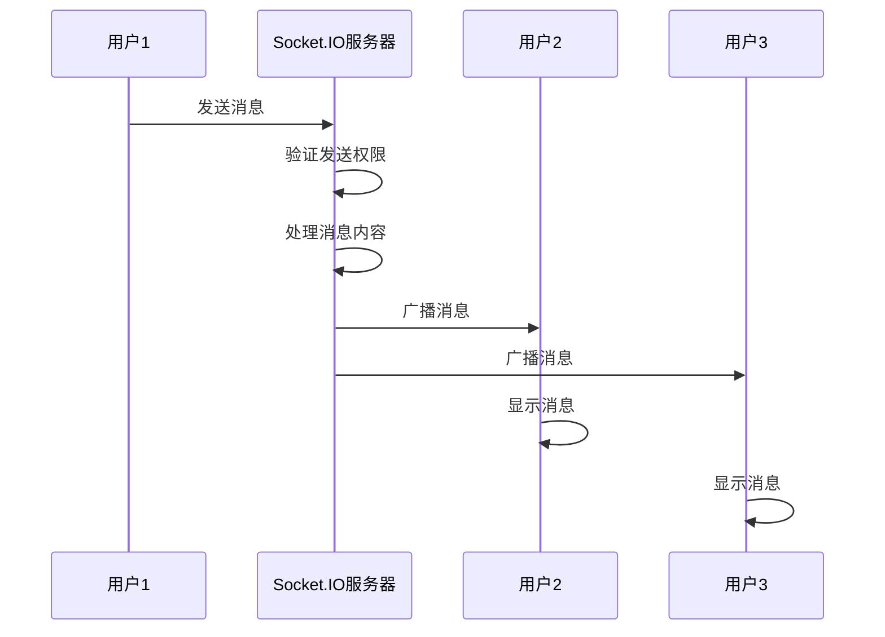
```mermaid
sequenceDiagram
    participant U1 as 用户1
    participant S as Socket.IO服务器
    participant U2 as 用户2
    participant U3 as 用户3

    U1->>S: 发送消息
    S->>S: 验证发送权限
    S->>S: 处理消息内容
    S->>U2: 广播消息
    S->>U3: 广播消息
    U2->>U2: 显示消息
    U3->>U3: 显示消息
```

#### 详细步骤
1. **消息发送**
   - 用户输入消息
   - 前端验证内容
   - 发送到服务器

2. **消息处理**
   - 服务器验证权限
   - 处理消息格式
   - 记录消息日志

3. **消息广播**
   - 获取房间成员
   - 广播给所有成员
   - 确认消息发送

## 管理员功能流程

### 1. 用户管理流程

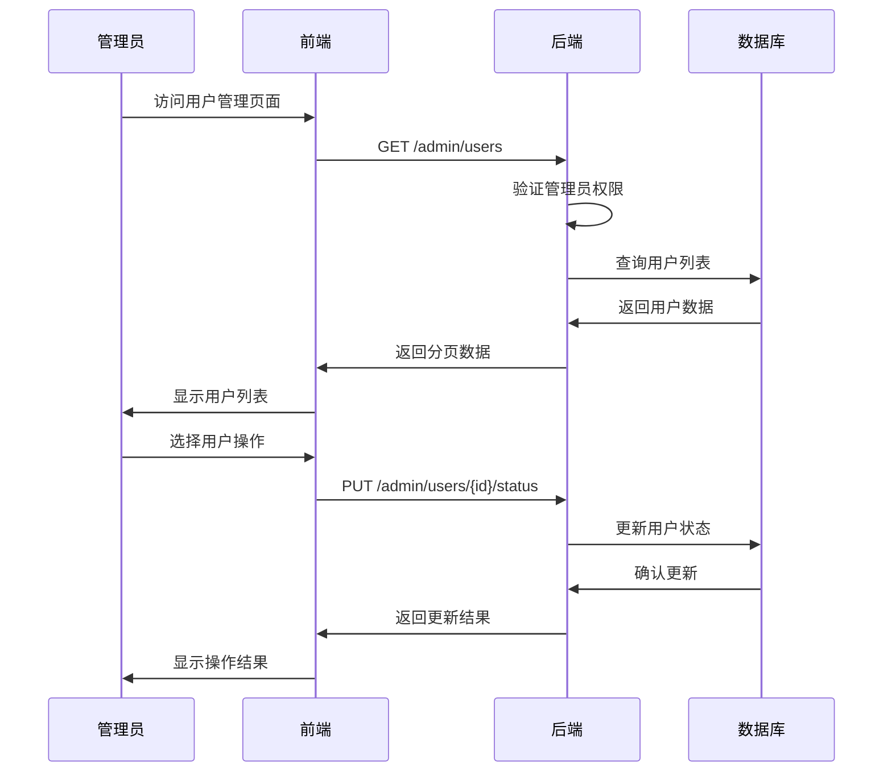
```mermaid
sequenceDiagram
    participant A as 管理员
    participant F as 前端
    participant B as 后端
    participant D as 数据库

    A->>F: 访问用户管理页面
    F->>B: GET /admin/users
    B->>B: 验证管理员权限
    B->>D: 查询用户列表
    D->>B: 返回用户数据
    B->>F: 返回分页数据
    F->>A: 显示用户列表
    A->>F: 选择用户操作
    F->>B: PUT /admin/users/{id}/status
    B->>D: 更新用户状态
    D->>B: 确认更新
    B->>F: 返回更新结果
    F->>A: 显示操作结果
```

### 2. 服务器管理流程

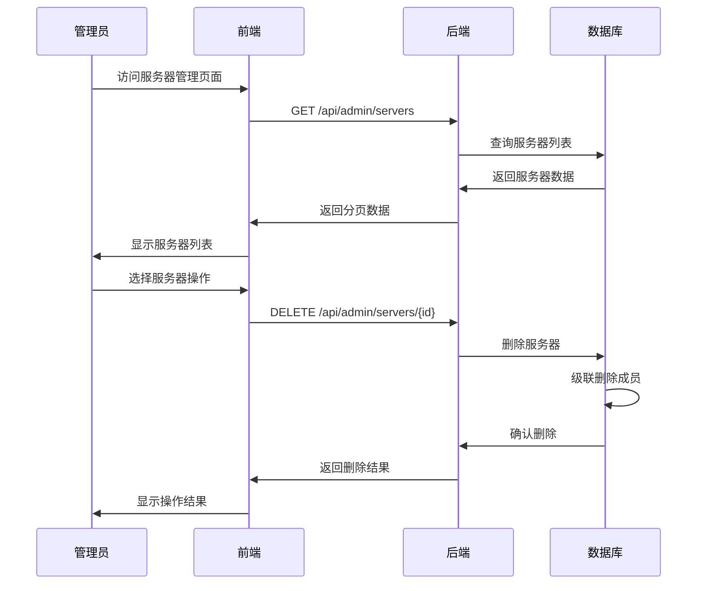
```mermaid
sequenceDiagram
    participant A as 管理员
    participant F as 前端
    participant B as 后端
    participant D as 数据库

    A->>F: 访问服务器管理页面
    F->>B: GET /api/admin/servers
    B->>D: 查询服务器列表
    D->>B: 返回服务器数据
    B->>F: 返回分页数据
    F->>A: 显示服务器列表
    A->>F: 选择服务器操作
    F->>B: DELETE /api/admin/servers/{id}
    B->>D: 删除服务器
    D->>D: 级联删除成员
    D->>B: 确认删除
    B->>F: 返回删除结果
    F->>A: 显示操作结果
```

## 错误处理流程

### 1. 认证错误处理

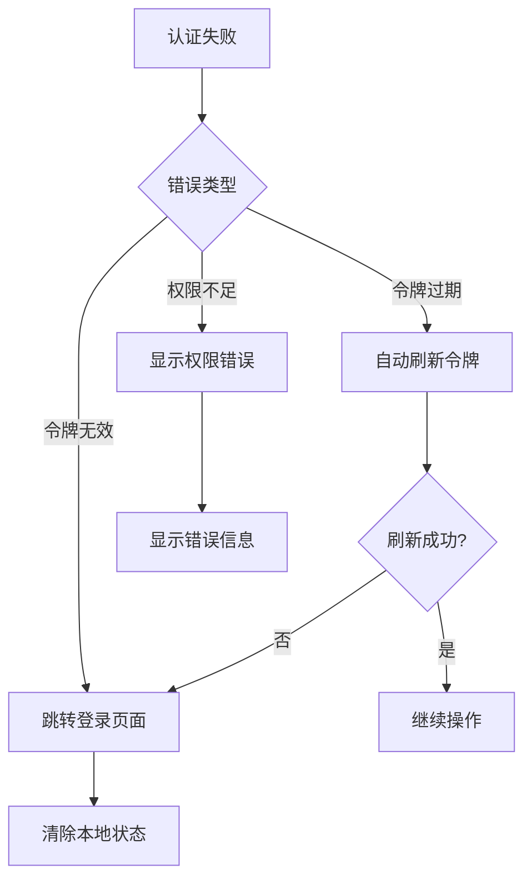
```mermaid
graph TD
    A[认证失败] --> B{错误类型}
    B -->|令牌过期| C[自动刷新令牌]
    B -->|令牌无效| D[跳转登录页面]
    B -->|权限不足| E[显示权限错误]
    C --> F{刷新成功?}
    F -->|是| G[继续操作]
    F -->|否| D
    D --> H[清除本地状态]
    E --> I[显示错误信息]
```

### 2. 网络错误处理

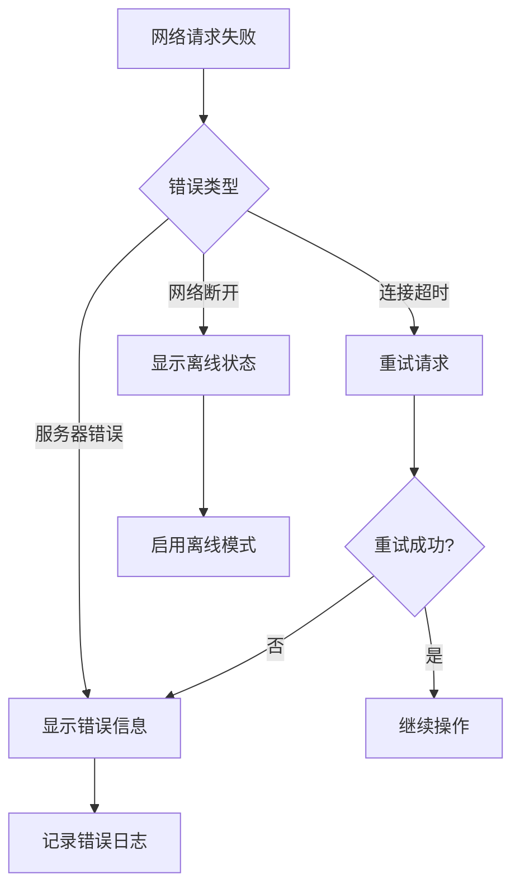
```mermaid
graph TD
    A[网络请求失败] --> B{错误类型}
    B -->|连接超时| C[重试请求]
    B -->|服务器错误| D[显示错误信息]
    B -->|网络断开| E[显示离线状态]
    C --> F{重试成功?}
    F -->|是| G[继续操作]
    F -->|否| D
    D --> H[记录错误日志]
    E --> I[启用离线模式]
```

## 性能优化流程

### 1. 缓存策略

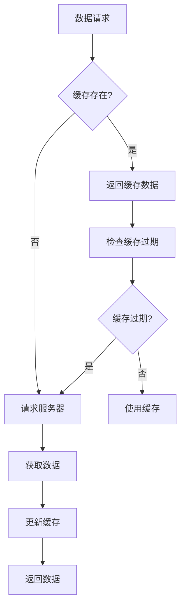
```mermaid
graph TD
    A[数据请求] --> B{缓存存在?}
    B -->|是| C[返回缓存数据]
    B -->|否| D[请求服务器]
    D --> E[获取数据]
    E --> F[更新缓存]
    F --> G[返回数据]
    C --> H[检查缓存过期]
    H --> I{缓存过期?}
    I -->|是| D
    I -->|否| J[使用缓存]
```

### 2. 请求优化

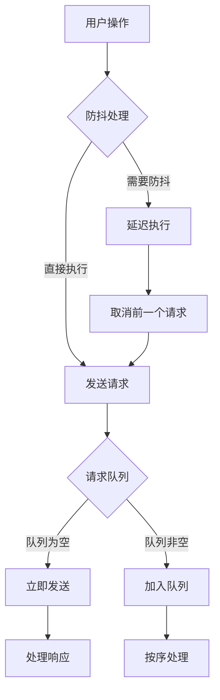
```mermaid
graph TD
    A[用户操作] --> B{防抖处理}
    B -->|需要防抖| C[延迟执行]
    B -->|直接执行| D[发送请求]
    C --> E[取消前一个请求]
    E --> D
    D --> F{请求队列}
    F -->|队列为空| G[立即发送]
    F -->|队列非空| H[加入队列]
    H --> I[按序处理]
    G --> J[处理响应]
```

## 监控和日志流程

### 1. 性能监控

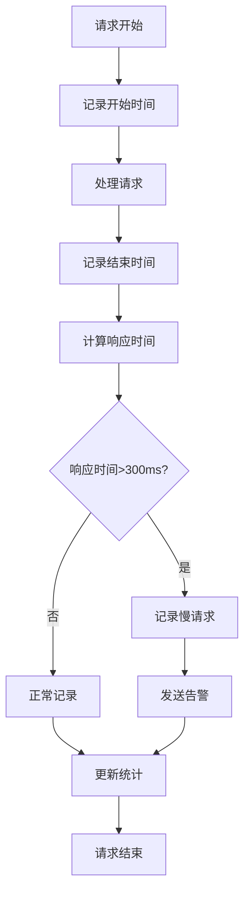
```mermaid
graph TD
    A[请求开始] --> B[记录开始时间]
    B --> C[处理请求]
    C --> D[记录结束时间]
    D --> E[计算响应时间]
    E --> F{响应时间>300ms?}
    F -->|是| G[记录慢请求]
    F -->|否| H[正常记录]
    G --> I[发送告警]
    H --> J[更新统计]
    I --> J
    J --> K[请求结束]
```

### 2. 错误监控

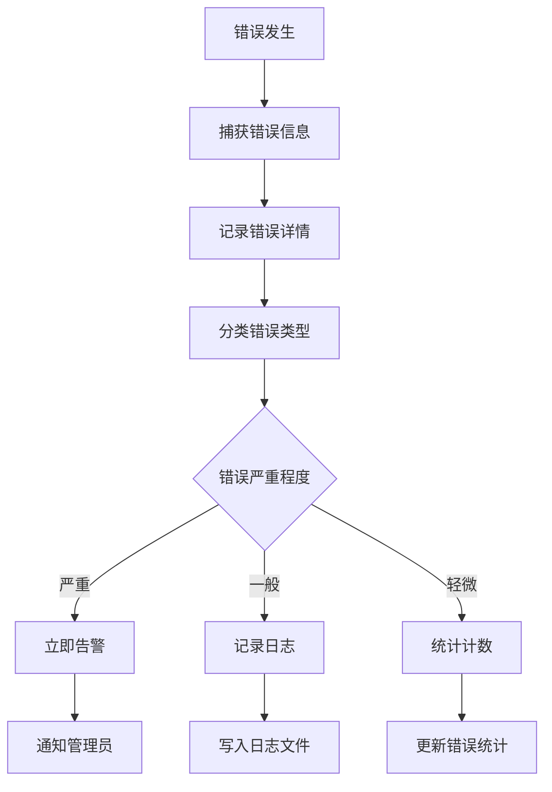
```mermaid
graph TD
    A[错误发生] --> B[捕获错误信息]
    B --> C[记录错误详情]
    C --> D[分类错误类型]
    D --> E{错误严重程度}
    E -->|严重| F[立即告警]
    E -->|一般| G[记录日志]
    E -->|轻微| H[统计计数]
    F --> I[通知管理员]
    G --> J[写入日志文件]
    H --> K[更新错误统计]
```

## 数据同步流程

### 1. 状态同步

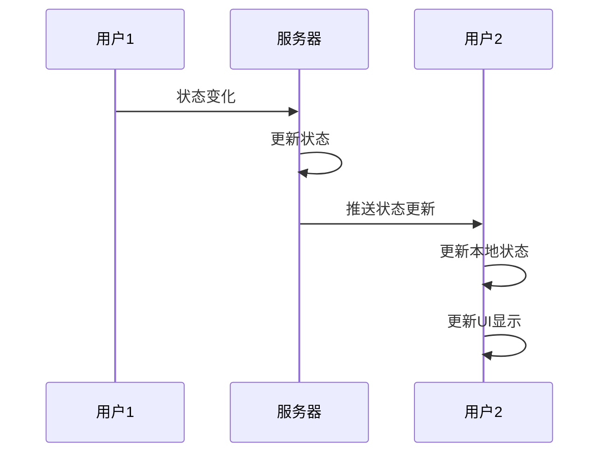
```mermaid
sequenceDiagram
    participant U1 as 用户1
    participant S as 服务器
    participant U2 as 用户2

    U1->>S: 状态变化
    S->>S: 更新状态
    S->>U2: 推送状态更新
    U2->>U2: 更新本地状态
    U2->>U2: 更新UI显示
```

### 2. 数据一致性

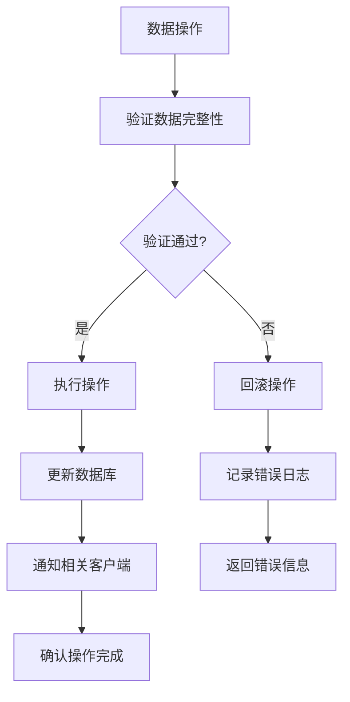
```mermaid
graph TD
    A[数据操作] --> B[验证数据完整性]
    B --> C{验证通过?}
    C -->|是| D[执行操作]
    C -->|否| E[回滚操作]
    D --> F[更新数据库]
    F --> G[通知相关客户端]
    G --> H[确认操作完成]
    E --> I[记录错误日志]
    I --> J[返回错误信息]
```

---

*本文档最后更新时间: 2025年1月*